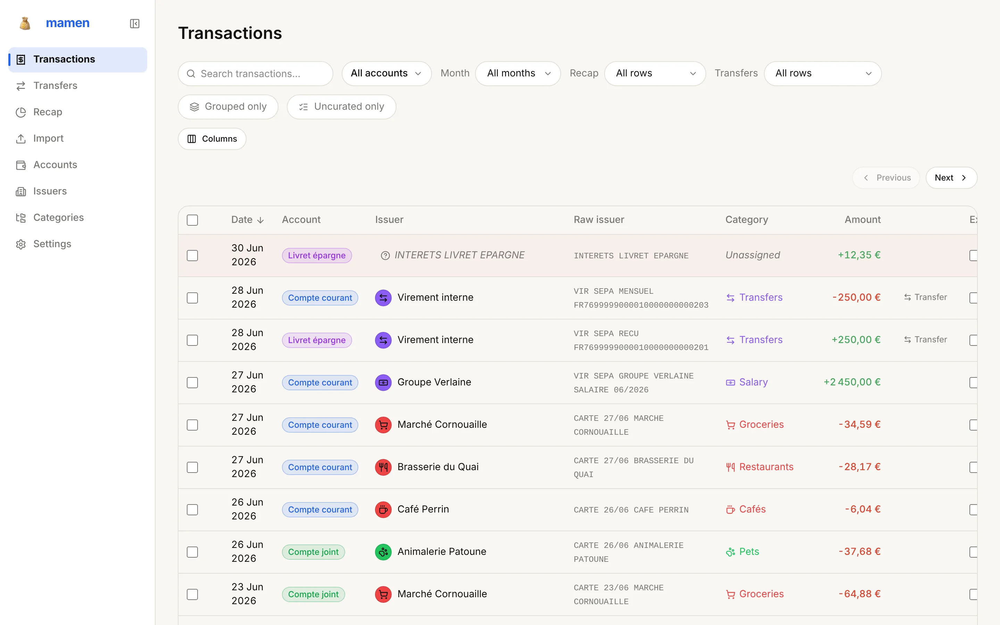
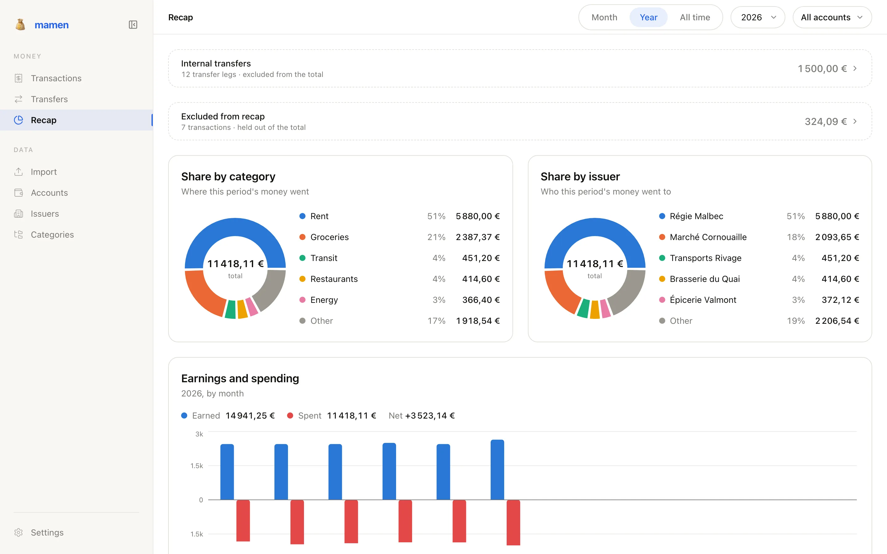

# mamen

A personal-finance app for one person's own accounts. You import bank
statements, curate the raw rows into issuers and categories, and read back where
the money went.

It is a self-hosted, single-user tool built for its author's own bank exports —
not a product, not multi-tenant, and not something you can sign up for. The
whole state is one SQLite file.

<!-- Both frames of each pair are captured from the demo stack over the seeded
     demo database, in one run: `.claude/skills/demo-screenshots/SKILL.md`. -->

**Transactions** — every imported row, curated in place.

<picture>
  <source media="(prefers-color-scheme: dark)" srcset="docs/screenshots/transactions-dark.webp">
  
</picture>

**Recap** — where the money went, by category and by issuer.

<picture>
  <source media="(prefers-color-scheme: dark)" srcset="docs/screenshots/recap-dark.webp">
  
</picture>

## What it does

- **Transactions** — the curation surface: a filterable, paginated table of
  every imported row. Give a row an issuer, a category or a note; flag it out of
  the spend totals; group several rows into one *bundle* that the rest of the app
  treats as a single operation.
- **Transfers** — movements between your own accounts. mamen suggests debit/credit
  pairings and you confirm or dismiss them; a confirmed transfer group is held
  out of spend.
- **Recap** — where the money went over a month, a calendar year or all time,
  broken down by issuer and by category, narrowable by account. Spend only, so
  internal transfers and excluded rows are reported beside the totals rather than
  inside them.
- **Import** — upload a statement, preview what it will create, and commit.
- **Accounts** — the accounts you import into, and a grid of which months have
  been imported for each.
- **Issuers** — who money goes to or from (payees *and* income sources). Each
  issuer can carry a default category, an image, and **matching rules** — regexes,
  optionally narrowed by amount, account or sign, that auto-assign the issuer to
  matching rows at import time and retroactively.
- **Categories** — a tree of any depth. Only leaves are assignable; folders group
  and total. A transaction's category is derived through its issuer unless you
  override it on the row.
- **Settings** — the AI surface: paste a credential per provider (stored
  encrypted, never handed back — only a masked hint), then choose which provider
  and which of its models runs each AI task. A provider with no stored credential
  is not offered, and picking a hosted vendor says plainly that your statement
  will be sent to it.

Two statement formats are supported today:

- **CSV**, parsed in the browser. One parser ships, for Green-Got, auto-detected
  by its header fingerprint, with a manual format picker for the ambiguous cases.
  Adding a bank means adding one parser module.
- **PDF**, extracted server-side by handing the file to whichever AI provider you
  picked in Settings. On the default, the local `claude` CLI, the statement's
  contents go to Anthropic's API; pick a hosted vendor instead and the statement
  is sent to that vendor as a document. Either way the upload is staged in a temp
  directory and deleted afterwards — it is never stored, and nothing reaches the
  database until you commit the preview.

Amounts are EUR only, formatted `fr-FR`. There is no multi-currency support and
no authentication of any kind — see [SECURITY.md](SECURITY.md).

## Stack

- [Bun](https://bun.sh) 1.3.4 — runtime, package manager and test runner host
- [Turborepo](https://turborepo.dev) — task graph across the five workspaces
- [Effect](https://effect.website) — the API is an Effect `HttpApi` server; the
  contract, the client and the handlers all derive from one schema
- SQLite (`@effect/sql-sqlite-bun`), migrated at server startup
- [React](https://react.dev) 19, [Vite](https://vite.dev),
  [TanStack](https://tanstack.com) Router / Query / Table / Virtual,
  [Tailwind](https://tailwindcss.com) v4, [Base UI](https://base-ui.com)
- [Vitest](https://vitest.dev) for tests, [Biome](https://biomejs.dev) for lint
  and formatting

## Packages

| Package | Path | Role |
| --- | --- | --- |
| `@mamen/shared` | `packages/shared` | The HTTP API contract and shared domain schemas. Source of truth for every entity. |
| `@mamen/api` | `packages/api` | Effect `HttpApi` server implementing the contract, over SQLite. |
| `@mamen/sdk` | `packages/sdk` | Typed client derived from the contract, wired to TanStack Query. |
| `@mamen/web` | `packages/web` | The React frontend. |
| `@mamen/landing-page` | `packages/landing-page` | The public page at the site root. Prerendered static HTML, its own image, no framework. |

Dependencies run one way: `shared` ← `api`, `shared` ← `sdk` ← `web`. Nothing in
`shared` may acquire a runtime dependency beyond `effect` and `@effect/platform`.
`landing-page` reads one string from `shared` — the prefix the app is served
under — and depends on nothing else in the repo.

## Running it locally

You need [Bun](https://bun.sh) — the repo pins `bun@1.3.4` — and, for PDF import,
the [`claude` CLI](https://docs.claude.com/en/docs/claude-code/overview) on your
`PATH`.

```sh
git clone https://github.com/lucasriondel/mamen.git
cd mamen
bun install
```

The API reads its environment from `packages/api/.env` (Bun loads it
automatically). Everything there has a working default except the key that
encrypts stored credentials, which has none on purpose — a default would be a
published encryption key:

```sh
# packages/api/.env
TOKEN_ENCRYPTION_KEY=<64 hex characters — openssl rand -hex 32>
```

The app starts without it and every feature but AI credentials works. **AI
credentials are not environment variables**: you paste each provider's key —
including the Claude Code token PDF import runs on (`claude setup-token`) — on
the **Settings** page, and mamen stores it encrypted with the key above. A
missing Claude Code token breaks PDF import alone, says so in the import screen,
and links you to Settings. See
[docs/operations/claude-cli-dependency.md](docs/operations/claude-cli-dependency.md).

Then:

```sh
bun dev
```

That runs every dev server through Turborepo:

- web — <http://localhost:5070/app/> (the site root redirects there)
- API — <http://localhost:5500>, with Scalar docs at
  <http://localhost:5500/docs> and the spec at
  <http://localhost:5500/api/openapi.json>
- landing page — <http://localhost:5080>, the public page the deployed site
  serves at its root

The app is served under `/app` in development and in production alike, so the
deployed site keeps its root for public landing pages. `/api` and `/uploads`
stay at the root, outside the prefix. Vite proxies both to the API, so the
browser only ever talks to one origin and there is no CORS to configure in
development. The database is
created and migrated on first boot at `packages/api/mamen.db`, seeded with a
base category tree; delete the file to start over.

Each dev server tees its output to a gitignored log at the repo root —
`logs/web.log`, `logs/server.log` and `logs/landing-page.log`. Read those before
starting a second instance.

### Demo data

A fresh database is an empty app. One command fills one with six months of an
invented household's banking — three accounts, twenty-odd counterparties,
recurring charges, an internal transfer, a bundle, a refund and rows still
waiting to be curated:

```sh
bun run seed:demo packages/api/demo.db
```

It creates and migrates the file itself, and re-running it replaces the demo
rather than duplicating it: every row carries a fixed id and a pinned date, so
the database is the same database on every machine. Point the API at it with
`DB_PATH=packages/api/demo.db` (the file is gitignored).

The path is required, and a file named like the API's own database is refused
unless you pass `--force` — seeding clears what it writes, and the default
`mamen.db` is where your real statements live.

**Every counterparty, amount and account number in it is invented**, and the
account numbers are from a reserved range that cannot exist. See
`packages/api/src/demo/dataset.ts`, which is the whole dataset.

### The demo stack (screenshots)

To photograph the app rather than develop against it, `docker-compose.demo.yml`
brings up a throwaway copy serving that seeded database — a one-shot seeder, the
API and the web container:

```sh
bun run demo:up      # http://localhost:5400/app/
bun run demo:down    # containers, volume and the images this built, gone
```

`demo:up` stays in the foreground, where the seeder's own summary is the
confirmation that the app has rows in it; `demo:down` runs in another terminal.
The base images it pulled are left alone — only what this stack built is
removed.

It runs happily beside `bun dev`: its own project name (`mamen-demo`), its own
volume and its own port, 5400, which is this stack's row in the table below. It
interpolates nothing, so the root `.env` — the self-host operator's, with a real
key in it — cannot reach it, and it carries no credential of its own. Without
one, PDF import is the only thing that stops working, and it says so.

The seeder runs on every `demo:up` and replaces the rows it owns, so tearing the
stack down and bringing it back gives the same app, with the same figures on the
same dates. It is not a deploy path: `docker-compose.yml`, below, is that one.

The images at the top of this file are taken from it by `bun run demo:shots`,
which drives a browser over the two surfaces in both colour schemes and writes
`docs/screenshots/`. The whole procedure — prerequisites, the teardown trap, and
the ways a capture goes wrong — is
[`.claude/skills/demo-screenshots/SKILL.md`](.claude/skills/demo-screenshots/SKILL.md).

### Ports

Every port mamen binds on the host, the reserved ones included. The numbers live
in `packages/shared/src/ports.ts`, which the Vite configs and the API's `PORT`
default import — so this table and the running servers cannot disagree.

| Port | Bound by | What answers there |
| --- | --- | --- |
| 5070 | web dev server | the SPA under its path prefix, proxying `/api` and `/uploads` |
| 5080 | landing-page dev server | the public page the deployed site serves at its root |
| 5500 | API | the HTTP API, its Scalar docs and the emitted OpenAPI spec |
| 5400 | demo stack web container | the app over the seeded demo database, for screenshots |
| 5401 | demo stack API container | the demo API directly; published only while debugging the stack |
| 5402 | self-host compose stack | the app and, proxied through it, the API — `WEB_PORT` moves it |

The Vite servers are pinned with `strictPort`, so a taken port fails to boot
instead of quietly moving to the next one — which would be some other app's.
The three container rows are allocated bottom-up from 5400. 5400 is what [the
demo stack](#the-demo-stack-screenshots) publishes and 5402 what [`docker
compose up`](#deploying) does; 5401 binds nothing — it is the demo API reached
directly, published by hand while debugging that stack and reserved so the
number taken then is not some other project's. The point of writing all three
down is that a stack has to come up while `bun dev` is already running. On a
machine that keeps a port registry, mamen's rows go there too; this table is the
copy the code is held to.

### Optional configuration

Everything else has a working default. The API reads:

| Variable | Default | What it does |
| --- | --- | --- |
| `PORT` | `5500` | API listen port. |
| `DB_PATH` | `mamen.db` | SQLite file, relative to the API's working directory. |
| `UPLOADS_DIR` | `uploads` | Where issuer images are written and served from. |
| `CORS_ORIGINS` | `http://localhost:5070` | Comma-separated allowed origins. Unused in production, where the SPA and the API share an origin. |
| `LOGODEV_TOKEN` | *(unset)* | Publishable logo.dev key backing issuer **Logo search**. Unset, the feature reports itself unconfigured and refuses. See [docs/operations/logo-search-setup.md](docs/operations/logo-search-setup.md). |
| `TOKEN_ENCRYPTION_KEY` | *(unset)* | 64 hex characters (`openssl rand -hex 32`) — the key AI provider credentials are encrypted with. Unset, storing one fails and stored ones read back as unreadable. No default, because a default would be a published encryption key. See [ADR 0011](docs/adr/0011-credentials-are-encrypted-at-rest.md). |

The web app reads `VITE_API_URL` (see `packages/web/.env.example`). Leave it
empty unless the API lives somewhere other than the same origin.

## Checks

```sh
bun run typecheck
bun run test
bun run lint
```

`bun run build` builds every package; `bun run --filter @mamen/web build`
produces the SPA bundle alone.

The API's `test` script runs a drift guard before Vitest: it re-derives the
OpenAPI spec from the contract and fails if `packages/api/openapi.json` no
longer matches. Change the contract and you commit the regenerated spec:

```sh
bun run --filter @mamen/api emit-openapi
```

## Deploying

Three containers behind one domain — a Bun API, an nginx-served SPA under `/app`
that proxies `/api` and `/uploads` to it, and an nginx-served landing page at the
root. The application has no authentication of its own; access control is
entirely the reverse proxy's. In the maintainer's deployment that is Cloudflare
Access over `/app`, `/api` and `/uploads`, with the site root left public.
[DEPLOY.md](DEPLOY.md) has the whole topology, the environment each container
needs, and the path split it is all derived from.

To run the app on one host instead, `docker-compose.yml` at the repo root builds
the API and the web container and wires them together:

```sh
cp .env.example .env    # fill in TOKEN_ENCRYPTION_KEY
docker compose up --build
```

The app comes up at <http://localhost:5402/app/> (`WEB_PORT` moves it; 5402 is
this stack's row in the [ports table](#ports)), with the database and uploaded
images on a named volume so they survive a `docker compose down`. The API
publishes no port of its own — the web container's nginx is the only way to it.
[`.env.example`](.env.example) lists what an operator can set. There is still
**no authentication**: no Traefik, no Cloudflare Access, nothing in front of the
app at all, so put it behind a VPN or an authenticating proxy, never straight on
the internet. [DEPLOY.md](DEPLOY.md#self-hosting-on-one-host-docker-compose) has
the rest of the limits.

## Documentation

- [CONTRIBUTING.md](CONTRIBUTING.md) — how to get set up and what is worth sending
- [SECURITY.md](SECURITY.md) — reporting a vulnerability, and what an instance holds
- [CONTEXT-MAP.md](CONTEXT-MAP.md) — the domain vocabulary. Every term the code
  uses (*issuer*, *bundle*, *uncurated*, *transfer group*) is defined once here,
  with the words it deliberately avoids. Read this before naming anything.
- [CLAUDE.md](CLAUDE.md) — the agent-facing entry point, kept current with the
  code; it points at the per-package `CONTEXT.md` files and the skill docs under
  `docs/agents/`.
- [docs/adr/](docs/adr) — system-wide architecture decisions, with
  [packages/web/docs/adr/](packages/web/docs/adr) for frontend-only ones.

Much of this codebase is written by coding agents working one issue at a time,
which is why the prose docs are unusually load-bearing: they are the shared
context, and they are expected to be true.

## Licence

[MIT](LICENSE) © Lucas Riondel
