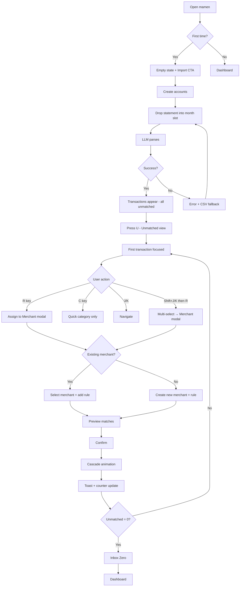
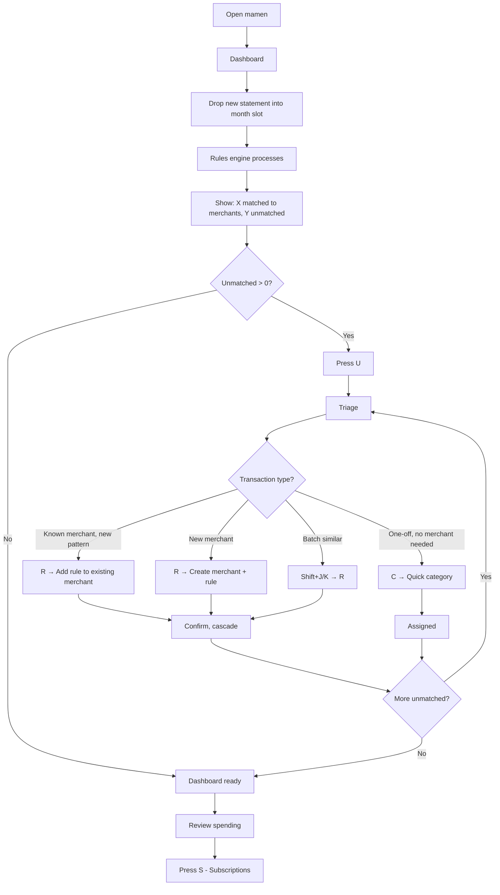
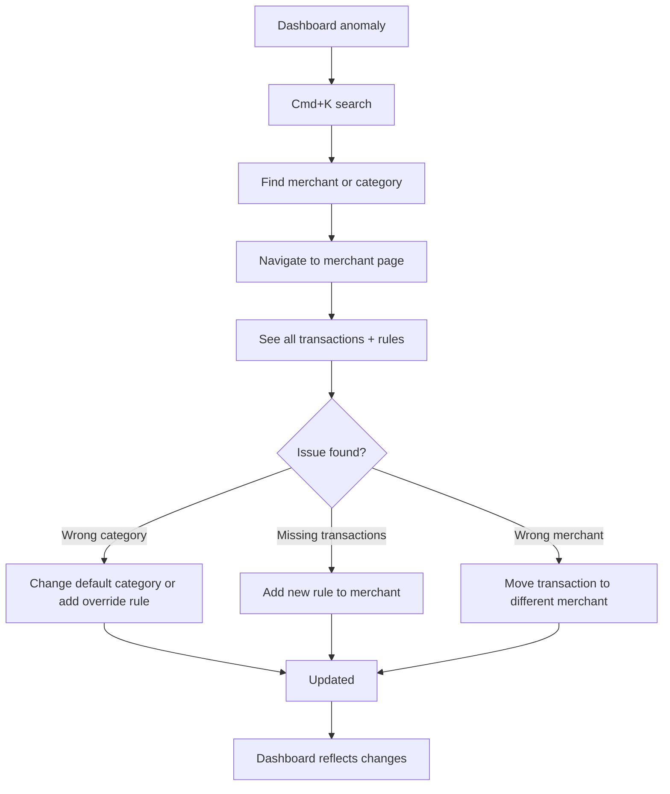
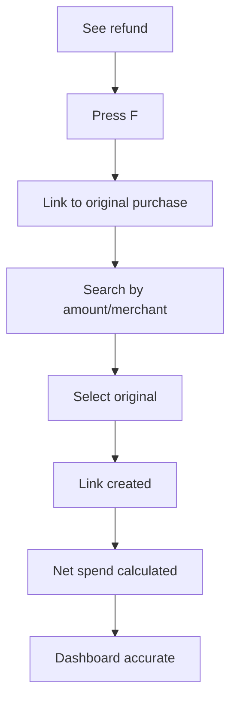

# UX Design Specification - mamen

**Author:** Lucas
**Date:** 2026-01-20

---

## Executive Summary

### Project Vision

**mamen** is "Linear for money" - a privacy-first personal finance visualization app that answers "where does my money go?" through user-controlled categorization. Unlike AI-driven finance apps that make opaque decisions, mamen uses LLM only for parsing bank statements into structured data. All categorization comes from user-defined rules that build up over time, creating a trusted, debuggable, personalized system.

The UX philosophy is keyboard-first, power-user focused - inspired by Linear, Raycast, and Superhuman. The goal is a tool users *want* to open, not another finance chore.

### Target Users

**Primary:** Solo developer (Lucas) building for personal use first
- Tech-savvy power user comfortable with regex and keyboard shortcuts
- Values speed, control, and transparency over hand-holding
- Frustrated with existing finance tools that feel like chores
- Wants a tool that matches the polish of Linear/Raycast

**Usage Context:**
- Desktop-primary (keyboard-first UX)
- Monthly maintenance workflow (~5 minutes with mature rules)
- Ad-hoc investigation when spending seems off
- Local-only, privacy-first - no accounts, no cloud

### Key Design Challenges

1. **Discoverability of power-user UX** - Keyboard shortcuts must be learnable without explicit onboarding tutorials
2. **First-import triage experience** - Many unmatched transactions on first use; rule creation must feel rewarding, not tedious
3. **Information density vs. clarity** - Dense data for power users, glanceable answers for "where does my money go?"
4. **Progressive disclosure** - Basics visible, power features discoverable, without UI clutter

### Design Opportunities

1. **Command palette as primary interface** - Cmd+K is the soul; every action accessible via fuzzy search
2. **Rule creation as the "aha moment"** - Watching transactions auto-categorize after creating a rule is the dopamine hit
3. **Keyboard shortcuts as muscle memory** - J/K, R, C, F, U, M, S - consistent, learnable, fast
4. **Visual progress feedback** - Unmatched count decreasing, rule coverage increasing, system "learning" your way

## Core User Experience

### Defining Experience

The core experience of mamen is **triage and rule-building**. Users import bank statements, see unmatched transactions, and create rules to categorize them. The magic moment is when a single rule creation causes multiple transactions to instantly categorize - the system "learns" the user's way.

**Core Loop:**
1. Import statements (drag-and-drop or file picker)
2. View unmatched transactions (U key)
3. Create rules from transactions (R key)
4. Watch unmatched count drop to zero
5. Review dashboard with trusted categorization

**Critical Interaction:** Rule creation from a focused transaction - press R, define pattern, assign category, see cascade effect.

### Platform Strategy

| Platform | Priority | Experience |
|----------|----------|------------|
| Desktop (1024px+) | Primary | Full keyboard UX, command palette, all features |
| Tablet (768-1023px) | Secondary | Touch-friendly, reduced shortcuts, full features |
| Mobile (<768px) | Tertiary | Read-only "check your spending" view |

**Technical Context:**
- Single Page Application (SPA)
- Local-first (IndexedDB) - full offline capability
- No native apps required
- Modern browsers only (Chrome, Firefox, Safari, Edge - latest 2 versions)

### Effortless Interactions

| Interaction | Behavior | Target |
|-------------|----------|--------|
| Command palette | Cmd+K opens instantly | < 50ms |
| List navigation | J/K moves focus, no delay | < 16ms (60fps) |
| Quick actions | R/C/F while focused on transaction | Immediate modal |
| View switching | U/M/S toggles view | Instant filter |
| Search | Type in palette, results stream in | < 100ms |
| Batch operations | Shift+J/K selects, action applies to all | Single action |

**Design Principle:** If the user has to think about how to do something, we've failed.

### Critical Success Moments

| Moment | Description | Design Goal |
|--------|-------------|-------------|
| **First Rule Cascade** | Create one rule, watch multiple transactions categorize | Visible count animation, satisfying feedback |
| **Monthly Inbox Zero** | Triage complete, unmatched = 0 | Celebration state, clear completion |
| **Dashboard Clarity** | See spending breakdown after triage | Clean visualization, answers "where did it go?" |
| **Investigation Success** | Find anomaly via search, understand it | Fast path from question to answer |
| **Rule Investment Payoff** | Month 3: 90% auto-categorized on import | Show "matched by rule X" attribution |

### Experience Principles

1. **Speed is Respect**
   - Every interaction responds in < 100ms
   - Command palette opens in < 50ms
   - Never make the user wait for the UI

2. **Trust Through Transparency**
   - Every categorization is user-defined
   - Rules are visible, editable, debuggable
   - No AI making decisions behind the scenes

3. **Progressive Mastery**
   - Basics work without shortcuts (click, drag)
   - Shortcuts discoverable through tooltips and palette
   - Power users never touch the mouse

4. **Inbox Zero for Money**
   - Unmatched transactions are a clear, finite queue
   - Zero unmatched is the goal state
   - Progress is always visible

5. **Keyboard-First, Mouse-Optional**
   - 100% of actions accessible via keyboard
   - Mouse exists for discovery and occasional use
   - Shortcuts are consistent and memorable (J/K/R/C/F/U/M/S)

## Desired Emotional Response

### Primary Emotional Goals

1. **Empowered & In Control**
   - "I built this system. I understand every categorization."
   - User owns the logic, not the AI
   - Debugging is possible because rules are explicit

2. **Efficient & Fast**
   - "This tool respects my time."
   - Keyboard-first means no friction
   - Every interaction feels instant

3. **Satisfied Progress**
   - "My rules are working. The system is learning MY way."
   - Visible progress (unmatched count decreasing)
   - Investment in rules pays off over time

4. **Trust & Confidence**
   - "I can see exactly why each transaction is categorized."
   - No AI black box
   - Rule attribution visible on every transaction

### Emotional Journey Mapping

| Stage | Emotion | Design Response |
|-------|---------|-----------------|
| First Discovery | Intrigued | Clean, minimal UI; obvious "Import" starting point |
| First Import | Curious, challenged | Clear unmatched count; "47 transactions need attention" |
| First Rule Creation | Delighted, surprised | Cascade animation; "12 transactions matched!" feedback |
| Triage Flow | Focused, productive | Keyboard flow; distraction-free; visible progress |
| Inbox Zero | Accomplished | Celebration state; empty state feels good |
| Dashboard View | Clarity | Trusted numbers; clean visualization |
| Return Visit | Familiar, efficient | State preserved; resume instantly |
| Error/Edge Cases | Calm, guided | Clear error messages; obvious recovery path |

### Micro-Emotions

**Target States:**
- Confidence → Clear affordances, obvious next actions
- Trust → Transparent logic, rule attribution
- Accomplishment → Progress feedback, inbox zero celebration
- Satisfaction → Fast responses, smooth animations
- Clarity → Dense but organized information

**Avoid States:**
- Confusion → Always show context (breadcrumbs, focus state)
- Skepticism → Show why every categorization happened
- Frustration → Make rule creation rewarding, not tedious
- Tedium → Batch operations, cascade effects
- Overwhelm → Focus modes, progressive disclosure
- Sluggishness → <100ms response time

### Design Implications

| Emotional Goal | UX Design Approach |
|----------------|-------------------|
| Empowerment | User-defined rules, no AI decisions, editable everything |
| Efficiency | Keyboard shortcuts, <100ms responses, batch operations |
| Progress satisfaction | Animated counters, rule cascade feedback, inbox zero state |
| Trust | Rule attribution on transactions, visible rule list, no magic |
| Delight | Satisfying animations on rule cascade, celebration on completion |

### Emotional Design Principles

1. **Reward Investment**
   - Every rule created should feel like progress
   - Show how many transactions a rule has matched over time
   - Make the payoff visible ("This rule has categorized 47 transactions")

2. **Speed Builds Trust**
   - Instant response validates the user's action
   - Lag creates doubt; speed creates confidence
   - Target: < 100ms for everything

3. **Transparency Over Magic**
   - Users should never wonder "why did it do that?"
   - Every categorization shows its source rule
   - AI does parsing only, never decision-making

4. **Progress is Motivating**
   - Unmatched count going down is inherently satisfying
   - Design for that "number going down" dopamine
   - Inbox zero should feel like an achievement

5. **Calm Errors**
   - When things go wrong, don't panic the user
   - Clear explanation, obvious recovery
   - "This PDF couldn't be parsed. Try CSV instead." - not "Error 500"

## UX Pattern Analysis & Inspiration

### Inspiring Products Analysis

#### Linear (Project Management)

| Aspect | Pattern | Lesson for mamen |
|--------|---------|------------------|
| Navigation | Command palette (Cmd+K) | Primary interface for all actions |
| Interaction | Keyboard-first, J/K navigation | Same pattern for transaction lists |
| Visual | Clean, minimal, high density | Information-dense but not cluttered |
| Feedback | Satisfying micro-animations | Rule cascade animation |
| Philosophy | Power users first | No hand-holding, progressive mastery |

**Key Takeaway:** Linear proves that keyboard-first UX can be both powerful AND accessible. The command palette is the soul.

#### Raycast (Launcher/Productivity)

| Aspect | Pattern | Lesson for mamen |
|--------|---------|------------------|
| Search | Fuzzy search with typo tolerance | Implement in command palette |
| Results | Instant as-you-type filtering | < 100ms search results |
| Extensibility | User-defined shortcuts | Command aliases (future) |
| UX | Replace menus with typing | Every action via palette |

**Key Takeaway:** Raycast shows that typing is faster than clicking. Fuzzy search forgives mistakes and feels magical.

#### Superhuman (Email)

| Aspect | Pattern | Lesson for mamen |
|--------|---------|------------------|
| Core Loop | Inbox zero as philosophy | Unmatched transactions → inbox zero |
| Speed | < 100ms as a feature | Same target for all interactions |
| Focus | Distraction-free interface | Focus modes (U/M/S) |
| Celebration | Inbox zero state | Celebrate when unmatched = 0 |

**Key Takeaway:** Superhuman proves that "inbox zero" is a powerful motivator. Progress toward zero is satisfying.

### Transferable UX Patterns

#### Navigation Patterns

| Pattern | Source | Application in mamen |
|---------|--------|---------------------|
| Command Palette | Linear, Raycast | Cmd+K for all actions and search |
| J/K Navigation | Linear, Superhuman | Up/down in transaction lists |
| Breadcrumbs | IDE/Dev tools | Always show current location |
| Focus Modes | Superhuman | U/M/S view toggles |

#### Interaction Patterns

| Pattern | Source | Application in mamen |
|---------|--------|---------------------|
| Quick Actions | Linear | R/C/F while focused on transaction |
| Batch Select | Linear | Shift+J/K to select multiple |
| Inline Editing | Notion | Edit rules without modal (future) |
| Fuzzy Search | Raycast | Typo-tolerant search everywhere |

#### Feedback Patterns

| Pattern | Source | Application in mamen |
|---------|--------|---------------------|
| Count Animation | Various | Animate unmatched count changes |
| Cascade Effect | Custom | Show transactions categorizing in real-time |
| Empty State | Superhuman | Celebrate inbox zero |
| Rule Attribution | Custom | "Matched by [rule name]" badge |

### Anti-Patterns to Avoid

| Anti-Pattern | Why It's Bad | mamen Alternative |
|--------------|--------------|-------------------|
| Wizard onboarding | Tedious, skipped | Jump straight into import |
| Modal dialogs for everything | Interrupts flow | Inline panels, palette |
| AI black box decisions | No trust, no debugging | User-defined rules only |
| Slow search (wait for Enter) | Friction | Instant as-you-type |
| Hidden keyboard shortcuts | Power features undiscoverable | Shortcuts in palette, tooltips |
| "Loading..." spinners | Breaks flow | Optimistic UI, instant response |
| Confirmation dialogs | Friction for common actions | Undo instead of confirm |

### Design Inspiration Strategy

**Adopt Directly:**
- Command palette as primary interface (Linear, Raycast)
- J/K navigation for all lists (Linear, Superhuman)
- Inbox zero philosophy for unmatched transactions (Superhuman)
- < 100ms response time as a requirement (Superhuman)
- Fuzzy search with typo tolerance (Raycast)

**Adapt for mamen:**
- Quick actions (R/C/F) - custom to financial context
- Rule cascade animation - custom "aha moment"
- Focus mode toggles (U/M/S) - adapted from Superhuman's filters
- Rule attribution badges - custom transparency feature

**Avoid:**
- AI-driven categorization (conflicts with trust goal)
- Onboarding wizards (conflicts with power-user identity)
- Confirmation dialogs (use undo instead)
- Slow interactions (breaks speed principle)

**Unique to mamen:**
- Progressive rule-building as core experience
- Transaction → Rule creation flow
- Unmatched count as primary progress metric
- Rule investment payoff tracking

## Design System Foundation

### Design System Choice

**Primary:** shadcn/ui + Tailwind CSS
**Primitives:** Radix UI (headless, accessible)
**Command Palette:** cmdk (used by Linear, Raycast, Vercel)

### Rationale for Selection

| Requirement | How shadcn/ui Delivers |
|-------------|------------------------|
| Linear-like aesthetic | Clean, minimal components out of the box |
| Keyboard-first UX | Built on Radix with excellent keyboard support |
| Command palette | cmdk library is industry standard |
| Solo developer | Copy-paste components, no vendor lock-in |
| Fast MVP | Pre-built components, Tailwind for rapid styling |
| Accessibility | ARIA patterns and focus management built-in |
| Customization | You own the code, modify anything |
| Dark mode | Tailwind dark mode support native |

**Why not alternatives:**
- Material Design / Ant Design: Enterprise feel, doesn't match premium aesthetic
- Custom from scratch: Too slow for solo MVP
- Bootstrap / Bulma: Dated aesthetic, not keyboard-first

### Implementation Approach

**Component Strategy:**

| Category | Approach |
|----------|----------|
| Layout | Custom with Tailwind (flexbox, grid) |
| Command Palette | cmdk (copy from shadcn) |
| Lists & Tables | shadcn Table + custom virtualization |
| Forms | shadcn Form components |
| Modals | Radix Dialog via shadcn |
| Navigation | Custom with keyboard handling |
| Feedback | shadcn Toast, custom animations |

**Installation:**
```bash
# Initialize shadcn/ui
npx shadcn-ui@latest init

# Add components as needed
npx shadcn-ui@latest add command
npx shadcn-ui@latest add dialog
npx shadcn-ui@latest add table
npx shadcn-ui@latest add form
```

### Customization Strategy

**Design Tokens:**

| Token | Purpose | Example |
|-------|---------|---------|
| Colors | Brand, semantic, state | Primary, success, warning, muted |
| Spacing | Consistent rhythm | 4px base unit |
| Typography | Hierarchy, readability | Inter or system font stack |
| Radius | Component corners | 6px default (Linear-like) |
| Shadows | Depth, elevation | Subtle, minimal |

**Custom Components Needed:**

1. **Transaction Row** - List item with keyboard focus, quick actions
2. **Rule Cascade Animation** - Custom feedback for rule creation
3. **Unmatched Counter** - Animated count with progress feel
4. **Category Badge** - With rule attribution tooltip
5. **Dashboard Charts** - Spending visualization (may use Recharts)

**Theming:**

```css
/* Example Tailwind config customization */
colors: {
  background: 'hsl(0 0% 100%)',
  foreground: 'hsl(222 47% 11%)',
  primary: 'hsl(222 47% 11%)',
  muted: 'hsl(210 40% 96%)',
  accent: 'hsl(210 40% 96%)',
}
```

**Dark Mode:** Support from day one via Tailwind's `dark:` prefix

## Detailed Interaction Design

### Defining Experience

**The Core Interaction:** "Create a rule, watch transactions categorize themselves"

This is mamen's Tinder swipe, Snapchat snap, Instagram filter. When a user creates a rule and watches multiple transactions instantly categorize, they experience:
- The system "learning" their way
- Investment paying off immediately
- Control and understanding (they defined the rule)

**One-liner:** "Build rules once, categorize forever"

### User Mental Model

**Current Solutions and Their Flaws:**

| Solution | How It Works | Pain Point |
|----------|--------------|------------|
| Spreadsheets | Manual categorization | Tedious, doesn't scale |
| Mint/YNAB | AI categorizes, user corrects | No learning, repeated corrections |
| Bank apps | Pre-set categories | No customization, doesn't fit user's thinking |

**The Mental Shift mamen Creates:**

| From | To |
|------|-----|
| "Fix AI mistakes" | "Build my system once" |
| "Tedious categorization" | "Satisfying rule creation" |
| "Endless manual work" | "Investment that pays off" |

**Potential Confusion Points:**
- First import: "Why unmatched?" → Clear guidance and obvious CTA
- Regex syntax: May need examples, helpers, preview
- Rule conflicts: Need clear priority/resolution display

### Success Criteria

| Criterion | Target | Measurement |
|-----------|--------|-------------|
| Time to create rule | < 10 seconds | From R press to rule saved |
| Feedback clarity | Immediate | Match count shown before confirm |
| Cascade satisfaction | High | Visible animation of categorization |
| Undo availability | Always | 10-second undo window |
| First rule creation | < 2 minutes | From first import to first rule |

**User feels successful when:**
- "12 transactions matched!" appears immediately
- Unmatched count visibly decreases (with animation)
- They can explain why any transaction is categorized

### Novel UX Patterns

**Established Patterns (Adopt):**
- Command palette (Cmd+K) - Linear, Raycast
- J/K list navigation - Vim, Gmail, Superhuman
- Quick actions from focus (R/C/F) - Linear

**Novel Pattern (mamen's Innovation):**

**Rule Cascade Feedback** - No product does this exactly:
1. User creates rule with pattern
2. System shows "12 transactions will match" in preview
3. User confirms
4. **Cascade animation:** Matched transactions highlight, then settle into categorized state
5. **Toast:** "12 transactions matched! [Undo]"
6. **Counter animation:** Unmatched count 47 → 35

**Familiar Metaphors:**
- "Find and replace all" in text editors
- Gmail filters organizing incoming mail
- Superhuman's "archive all from sender"

### Experience Mechanics

#### Rule Creation Flow

**Step 1: Initiation**
- User navigates to unmatched transaction with J/K
- Presses R (or sees "Create Rule" on hover)
- Modal opens with merchant string pre-filled

**Step 2: Interaction**

```
┌─────────────────────────────────────────┐
│ Create Rule                         [×] │
├─────────────────────────────────────────┤
│ Pattern:  [AMZN.*____________]          │
│           ↳ Matches 12 transactions     │
│                                         │
│ Category: [Shopping > Online ▼]         │
│                                         │
│ Preview:                                │
│   • AMZN*1234XYZ     €29.99            │
│   • AMZN*5678ABC     €15.00            │
│   • AMZN*9012DEF     €42.50            │
│   ... and 9 more                        │
│                                         │
│         [Cancel]  [Create Rule]         │
└─────────────────────────────────────────┘
```

- **Pattern field:** Pre-filled with escaped merchant string, editable
- **Live match count:** Updates as user types (< 100ms)
- **Preview list:** Shows matching transactions in real-time
- **Category picker:** Searchable dropdown, keyboard navigable (↑↓ Enter)

**Step 3: Feedback**
- User presses Enter or clicks "Create Rule"
- Modal closes
- **Cascade animation:** Matching transactions briefly highlight, category badge appears
- **Toast notification:** "12 transactions matched! [Undo]"
- **Counter animation:** Unmatched count decrements with easing

**Step 4: Completion**
- User returns to unmatched view
- Next unmatched transaction auto-focused
- Progress feels tangible (fewer items remaining)
- Repeat until inbox zero

#### Keyboard Flow (No Mouse)

```
J/K → Navigate to transaction
R   → Open rule creation modal
Tab → Move to category field
↑↓  → Select category
Enter → Create rule
(toast appears, cascade animates)
J/K → Continue to next unmatched
```

**Target:** Full rule creation in 3-5 keystrokes after pattern entry

## Visual Design Foundation

### Color System

**Approach:** Dark-first palette inspired by shadcn/ui, matching Linear/Raycast aesthetic

#### Base Palette

| Token | Value | Usage |
|-------|-------|-------|
| `background` | `hsl(222 47% 4%)` | App background |
| `foreground` | `hsl(210 40% 98%)` | Primary text |
| `card` | `hsl(222 47% 6%)` | Cards, elevated surfaces |
| `card-foreground` | `hsl(210 40% 98%)` | Text on cards |
| `popover` | `hsl(222 47% 6%)` | Modals, command palette |
| `primary` | `hsl(210 40% 98%)` | Primary actions, focus |
| `primary-foreground` | `hsl(222 47% 4%)` | Text on primary buttons |
| `secondary` | `hsl(217 33% 17%)` | Secondary surfaces |
| `muted` | `hsl(217 33% 17%)` | Muted backgrounds |
| `muted-foreground` | `hsl(215 20% 65%)` | Muted text, placeholders |
| `accent` | `hsl(217 33% 17%)` | Hover states |
| `border` | `hsl(217 33% 17%)` | Borders, dividers |
| `input` | `hsl(217 33% 17%)` | Input backgrounds |
| `ring` | `hsl(212 100% 47%)` | Focus rings |

#### Semantic Colors

| Token | Value | Usage |
|-------|-------|-------|
| `success` | `hsl(142 76% 36%)` | Categorized transactions, matched rules |
| `warning` | `hsl(38 92% 50%)` | Anomalies, attention needed |
| `destructive` | `hsl(0 84% 60%)` | Delete actions, errors |
| `info` | `hsl(212 100% 47%)` | Links, informational |

#### Category Colors (Dashboard)

For spending visualization, use a set of 8-10 distinguishable colors optimized for dark backgrounds:

```css
--category-1: hsl(212 100% 60%);  /* Blue */
--category-2: hsl(142 76% 46%);   /* Green */
--category-3: hsl(38 92% 55%);    /* Orange */
--category-4: hsl(280 80% 60%);   /* Purple */
--category-5: hsl(0 84% 65%);     /* Red */
--category-6: hsl(180 70% 50%);   /* Cyan */
--category-7: hsl(330 80% 60%);   /* Pink */
--category-8: hsl(60 70% 55%);    /* Yellow */
```

### Typography System

**Font Stack:**
- **Primary:** Inter, -apple-system, BlinkMacSystemFont, "Segoe UI", Roboto, sans-serif
- **Monospace:** "JetBrains Mono", "Fira Code", ui-monospace, monospace

**Type Scale:**

| Level | Size | Weight | Line Height | Usage |
|-------|------|--------|-------------|-------|
| `h1` | 30px (1.875rem) | 600 | 1.2 | Page titles |
| `h2` | 24px (1.5rem) | 600 | 1.2 | Section headers |
| `h3` | 20px (1.25rem) | 500 | 1.3 | Subsections |
| `body` | 14px (0.875rem) | 400 | 1.5 | Default text |
| `body-sm` | 13px (0.8125rem) | 400 | 1.4 | Dense lists |
| `small` | 12px (0.75rem) | 400 | 1.4 | Labels, captions |
| `mono` | 13px (0.8125rem) | 400 | 1.4 | Amounts, regex patterns |

**Font Features:**
- Tabular numbers for amounts (consistent digit width)
- Slightly tighter letter-spacing for headings (-0.02em)

### Spacing & Layout Foundation

**Base Unit:** 4px

**Spacing Scale:**

| Token | Value | Usage |
|-------|-------|-------|
| `space-0.5` | 2px | Micro adjustments |
| `space-1` | 4px | Tight gaps, icon padding |
| `space-2` | 8px | Default inline spacing |
| `space-3` | 12px | Component internal padding |
| `space-4` | 16px | Section spacing |
| `space-5` | 20px | Medium gaps |
| `space-6` | 24px | Card padding |
| `space-8` | 32px | Section gaps |
| `space-10` | 40px | Large section gaps |

**Border Radius:**

| Token | Value | Usage |
|-------|-------|-------|
| `radius-sm` | 4px | Small buttons, badges |
| `radius-md` | 6px | Default (cards, inputs, modals) |
| `radius-lg` | 8px | Large containers |
| `radius-full` | 9999px | Pills, avatars |

**Layout Principles:**
- **Dense but readable:** Power-user aesthetic with efficient use of space
- **Clear hierarchy:** Visual weight guides attention
- **Consistent rhythm:** Spacing follows the 4px grid

**Component Density:**

| Component | Height | Padding |
|-----------|--------|---------|
| Transaction row | 48px | 12px horizontal |
| Button (default) | 36px | 16px horizontal |
| Button (small) | 28px | 12px horizontal |
| Input | 36px | 12px horizontal |
| Command palette item | 40px | 12px horizontal |

### Accessibility Considerations

**Contrast Requirements:**
- Body text on background: 7:1+ (exceeds WCAG AAA)
- Muted text: 4.5:1+ (meets WCAG AA)
- Interactive elements: 3:1+ against adjacent colors

**Focus States:**
- All interactive elements have visible focus ring (`ring` color)
- Focus ring offset: 2px
- Focus visible only on keyboard navigation (`:focus-visible`)

**Color Independence:**
- Don't rely on color alone to convey meaning
- Categorized transactions: color + icon/badge
- Anomalies: color + icon indicator
- Success/error states: color + text message

**Motion:**
- Respect `prefers-reduced-motion`
- Cascade animations can be disabled
- Essential feedback remains (count changes visible)

## Design Direction Decision

### Selected Direction: Linear Layout

**Decision Date:** 2026-01-21

After reviewing 6 design direction mockups, the **Linear Layout** direction was selected as the primary visual structure for mamen.

### Why Linear Layout

| Aspect | Alignment with mamen |
|--------|---------------------|
| **Visual Hierarchy** | Sidebar + main content creates clear navigation |
| **Scalability** | List view handles 1000+ transactions efficiently |
| **Power-User Fit** | Clean, dense, focused - matches Linear aesthetic |
| **Keyboard UX** | Main content area is keyboard navigation zone |
| **Information Density** | Enough context at a glance without overwhelm |

### Layout Structure

```
┌──────────────────────────────────────────────────────────────┐
│ mamen                              [Search ⌘K]    [Settings] │
├────────────────┬─────────────────────────────────────────────┤
│                │                                             │
│  Navigation    │  Main Content Area                          │
│  ────────────  │  ─────────────────                          │
│  □ Dashboard   │  [Breadcrumb: Dashboard > Shopping]         │
│  □ Transactions│                                             │
│  □ Rules       │  ┌─────────────────────────────────────┐    │
│  □ Merchants   │  │ Transaction List / Dashboard /      │    │
│                │  │ Rule Editor / etc.                  │    │
│  Focus Modes   │  │                                     │    │
│  ────────────  │  │ Keyboard navigation zone            │    │
│  U Unmatched   │  │ J/K to navigate, R/C/F actions      │    │
│  M This Month  │  │                                     │    │
│  S Subscriptions│ └─────────────────────────────────────┘    │
│                │                                             │
│  Stats         │  [Unmatched: 12]  [Matched: 95%]           │
│  ────────────  │                                             │
│  Unmatched: 12 │                                             │
│  Rules: 47     │                                             │
│                │                                             │
└────────────────┴─────────────────────────────────────────────┘
```

### Key Elements

**Sidebar (Left)**
- Primary navigation (Dashboard, Transactions, Rules, Merchants)
- Focus mode shortcuts (U/M/S)
- Quick stats (unmatched count, rule count)
- Collapsible on smaller viewports

**Header (Top)**
- App branding (minimal)
- Global search trigger (Cmd+K)
- Settings/preferences access

**Main Content Area**
- Breadcrumb navigation
- Context-specific content (transaction list, dashboard charts, rule editor)
- Keyboard navigation zone
- Status bar (unmatched count, match percentage)

### Responsive Behavior

| Viewport | Sidebar | Layout |
|----------|---------|--------|
| Desktop (1024px+) | Visible, fixed width (~220px) | Full Linear Layout |
| Tablet (768-1023px) | Collapsible, toggle button | Responsive margins |
| Mobile (<768px) | Hidden, hamburger menu | Single column, stacked |

### Design Direction Mockups Reference

The full interactive mockups are available at:
`_bmad-output/planning-artifacts/ux-design-directions.html`

Open in browser to explore all 6 directions for future reference.

## User Journey Flows

### Merchants & Rules Model

#### Core Concept

**Merchants** are clean, readable entities that group transactions (like Gmail Labels).
**Rules** are patterns that match transaction strings to merchants (like Gmail Filters).

```
Transaction String          Rule                    Result
─────────────────────────────────────────────────────────────
"AMZN*1234XYZ"        →    matches AMZN.*     →    Merchant: Amazon
"AMAZON.COM/PRIME"    →    matches AMAZON.*   →    Merchant: Amazon
"AMZN*DIGITAL*5678"   →    matches AMZN.*     →    Merchant: Amazon
```

#### Data Model

```
Merchant
├── name: "Amazon"
├── default_category: "Shopping > Online" (optional)
├── rules: [
│     { pattern: "AMZN.*" },
│     { pattern: "AMAZON\\.COM.*" },
│     { pattern: "AMAZON PRIME.*", category_override: "Subscriptions" }
│   ]
└── transactions: [all matching any rule]
```

- **Merchant owns its rules** - rules exist to match transactions to that merchant
- **Default category** - auto-applied to matched transactions
- **Category override per rule** - specific patterns can override the default (e.g., "AMAZON PRIME" → Subscriptions)
- **Category override per transaction** - one-off exceptions

---

### Journey 1: First Import



**Key Interactions:**
- **Account-based import:** Statements dropped into specific account + month slots (no deduplication needed)
- **Rule creation:** R for simple mode, Shift+R for power mode
- **Multi-select rules:** Shift+J/K to select, R to create pattern from selection
- **Cascade feedback:** Visual highlight + toast + counter animation

---

### Journey 2: Monthly Maintenance



**Key Interactions:**
- **Structured import:** Each account has month slots, no overlap possible
- **Auto-matching:** Existing rules apply automatically
- **Batch efficiency:** Multi-select + rule from selection for similar merchants
- **Review flow:** Dashboard → comparison → subscription audit

---

### Journey 3: Investigation



**Key Interactions:**
- **Fast search:** Cmd+K with fuzzy matching, typo tolerance
- **Merchant context:** Detail page shows history, rules, first-time flag
- **Re-categorization:** Edit rule or create more specific override
- **Immediate feedback:** Dashboard updates after fix

---

### Journey 4: Refund Handling



**Key Interactions:**
- **Quick action:** F key on any transaction
- **Smart search:** Pre-filtered by similar amount and merchant
- **Visual relationship:** Linked transactions show connection
- **Accurate totals:** Refunds excluded from gross, net displayed

---

### Merchant Assignment UX

#### R Key: Assign to Merchant (Single Transaction)

```
┌─────────────────────────────────────────────────────────────┐
│ Assign to Merchant                                      [×] │
├─────────────────────────────────────────────────────────────┤
│ Transaction: "AMZN*1234XYZ"                                 │
│                                                             │
│ Assign to:                                                  │
│   ○ Existing merchant: [Search..._______________▼]          │
│   ● New merchant: [Amazon___________________]               │
│                                                             │
│ Create rule from pattern:                                   │
│   ○ Exact: "AMZN*1234XYZ" (1 transaction)                   │
│   ● Prefix: "AMZN*" (12 transactions)                       │
│   ○ Custom pattern...                                       │
│                                                             │
│ Category: [Shopping > Online ▼]                             │
│   ☑ Set as default for this merchant                        │
│                                                             │
│ Preview: 12 transactions will match                         │
│   • AMZN*1234XYZ      €29.99                               │
│   • AMZN*5678ABC      €15.00                               │
│   • AMZN*9012DEF      €42.50                               │
│   ... and 9 more                                            │
│                                                             │
│              [Cancel]  [Create ↵]                           │
└─────────────────────────────────────────────────────────────┘
```

#### R Key: Add Rule to Existing Merchant

When transaction should belong to existing merchant but doesn't match current rules:

```
┌─────────────────────────────────────────────────────────────┐
│ Assign to Merchant                                      [×] │
├─────────────────────────────────────────────────────────────┤
│ Transaction: "AMAZON.COM/BILL"                              │
│                                                             │
│ Assign to:                                                  │
│   ● Existing merchant: [Amazon ▼]                           │
│       Current rules: AMZN.*, AMAZON PRIME.*                 │
│   ○ New merchant: [_________________________]               │
│                                                             │
│ Add rule to "Amazon":                                       │
│   ○ Exact: "AMAZON.COM/BILL" (1 transaction)                │
│   ● Prefix: "AMAZON.COM.*" (3 transactions)                 │
│   ○ Custom pattern...                                       │
│                                                             │
│ Category: [Shopping > Online] (merchant default)            │
│   ○ Use merchant default                                    │
│   ○ Override for this rule: [____________▼]                 │
│                                                             │
│ Preview: 3 transactions will be added to "Amazon"           │
│                                                             │
│              [Cancel]  [Add Rule ↵]                         │
└─────────────────────────────────────────────────────────────┘
```

#### R Key: Multi-Select (2+ Transactions)

```
┌─────────────────────────────────────────────────────────────┐
│ Assign 4 Transactions to Merchant                       [×] │
├─────────────────────────────────────────────────────────────┤
│ Selected:                                                   │
│   • UBER TRIP 1234                                          │
│   • UBER EATS ABC                                           │
│   • UBER TRIP 5678                                          │
│   • LYFT RIDE 9012                                          │
│                                                             │
│ Assign to:                                                  │
│   ○ Existing merchant: [Search..._______________▼]          │
│   ● New merchant: [Rideshare________________]               │
│                                                             │
│ Create rules:                                               │
│   ● "(UBER|LYFT).*" (4 of 4 selected, +2 others)            │
│   ○ Separate rules: "UBER.*" and "LYFT.*"                   │
│   ○ Custom pattern...                                       │
│                                                             │
│ Category: [Transportation > Rideshare ▼]                    │
│   ☑ Set as default for this merchant                        │
│                                                             │
│ Preview: 6 transactions will match                          │
│                                                             │
│              [Cancel]  [Create ↵]                           │
└─────────────────────────────────────────────────────────────┘
```

**Pattern Generation Logic:**
1. Find longest common prefix (≥3 chars) → suggest `PREFIX.*`
2. If no common prefix → extract unique roots → suggest `(ROOT1|ROOT2).*`
3. If roots too diverse (>5 unique) → "No pattern found" fallback

#### Pattern Suggestions with Unwanted Match Warning

```
⚠️ Pattern "(UBER|LYFT).*" also matches:
   • UBER EATS ABC (might be Dining, not Transport)
   • UBER EATS DEF

Options:
   [Create separate merchants: "Uber Rides" + "Uber Eats"]
   [Use "UBER TRIP.*" + "LYFT.*" instead]
   [Include all under one merchant anyway]
```

#### No Common Pattern Fallback

```
⚠️ No common pattern found

Selected transactions are too different for one rule.
Options:
   [Create merchant with multiple specific rules]
   [Assign to merchant without rule (manual only)]
   [Cancel and handle individually]
```

#### Simple Mode vs Power Mode

**Simple Mode (R key - default):**
- System suggests patterns based on merchant string
- User picks from suggestions or goes custom
- No regex knowledge required

**Power Mode (Shift+R or Tab from simple):**
- Raw regex input field
- Live validation (✓ valid / ✗ invalid)
- Cheatsheet available via [?] icon

**Regex Cheatsheet:**
```
┌─────────────────────────────────┐
│ Pattern Help              [?]   │
├─────────────────────────────────┤
│ .*      any characters          │
│ ^ABC    starts with ABC         │
│ XYZ$    ends with XYZ           │
│ [0-9]+  one or more digits      │
│ ABC|DEF matches ABC or DEF      │
│ \.      literal dot             │
│ \*      literal asterisk        │
└─────────────────────────────────┘
```

#### Conflict Resolution

When a new rule overlaps with existing rules (most specific wins):

```
┌─────────────────────────────────────────────────────────────┐
│ ⚠️ Pattern Overlap Detected                                 │
├─────────────────────────────────────────────────────────────┤
│ Your pattern "AMZN.*KINDLE.*" overlaps with:                │
│                                                             │
│   Existing: "AMZN.*" → Amazon (Shopping > Online)           │
│                                                             │
│ Your rule is more specific and will take priority           │
│ for 3 matching transactions.                                │
│                                                             │
│   [Edit Existing Rule]  [Create New Rule ↵]                 │
└─────────────────────────────────────────────────────────────┘
```

---

### Merchant Page

```
┌─────────────────────────────────────────────────────────────────┐
│ ← Back                                                  [···]   │
├─────────────────────────────────────────────────────────────────┤
│                                                                 │
│  Amazon                                        🆕 First seen    │
│  Default: Shopping > Online                       Jan 2024      │
│                                                                 │
│  ┌─────────────┬─────────────┬─────────────┬─────────────┐     │
│  │ Total Spent │ Transactions│   Average   │  Last Seen  │     │
│  │  €1,247.50  │     34      │   €36.69    │  3 days ago │     │
│  └─────────────┴─────────────┴─────────────┴─────────────┘     │
│  Monthly avg: €156.88    │    vs last month: +12%               │
│  First seen: Jan 2024    │    Last: 3 days ago                  │
│                                                                 │
│  Matching Rules                                      [+ Add]    │
│  ───────────────────────────────────────────────────────────    │
│  │ AMZN.*              │ 28 matches │ (default)      │ [Edit]│  │
│  │ AMAZON\.COM.*       │  4 matches │ (default)      │ [Edit]│  │
│  │ AMAZON PRIME.*      │  2 matches │ → Subscriptions│ [Edit]│  │
│                                                                 │
│  Transactions                                    [This Year ▼]  │
│  ───────────────────────────────────────────────────────────    │
│  │ Jan 18 │ AMZN*1234XYZ      │  €29.99  │ Shopping        │   │
│  │ Jan 15 │ AMZN*5678ABC      │  €15.00  │ Shopping        │   │
│  │ Jan 12 │ AMAZON PRIME      │  €14.99  │ Subscriptions   │   │
│  │ Jan 08 │ AMAZON.COM/BILL   │  €42.50  │ Shopping        │   │
│  │ ...                                                      │   │
│                                                                 │
│  ⚠️ Mixed categories: 32 Shopping, 2 Subscriptions              │
│     This is expected - "AMAZON PRIME.*" overrides to Subs       │
│                                                                 │
├─────────────────────────────────────────────────────────────────┤
│  [E] Edit Merchant    [D] Change Default    [+ Add Rule]        │
└─────────────────────────────────────────────────────────────────┘
```

**Key Elements:**
- **Merchant name** prominent at top
- **Default category** shown below name
- **🆕 First seen badge** - prominent for new merchants
- **Full stats:** total, count, average, monthly avg, month-over-month change, first/last seen
- **Rules section:** each rule with match count and category (default or override)
- **Transaction list:** with category per row, time filter
- **Mixed category note:** explains when expected (override rules)
- **Keyboard actions:** in footer

---

### Import Architecture

#### Account-Based Statement Management

```
┌─────────────────────────────────────────────────────────────┐
│ Accounts & Statements                                       │
├─────────────────────────────────────────────────────────────┤
│                                                             │
│ Main Bank (Checking)                          [+ Add Month] │
│ ┌───────┬───────┬───────┬───────┬───────┬───────┐          │
│ │  Jan  │  Feb  │  Mar  │  Apr  │  May  │  Jun  │          │
│ │  ✓    │  ✓    │  ✓    │  ◌    │  ◌    │  ◌    │          │
│ └───────┴───────┴───────┴───────┴───────┴───────┘          │
│                                                             │
│ Savings Account                               [+ Add Month] │
│ ┌───────┬───────┬───────┬───────┬───────┬───────┐          │
│ │  Jan  │  Feb  │  Mar  │  Apr  │  May  │  Jun  │          │
│ │  ✓    │  ✓    │  ◌    │  ◌    │  ◌    │  ◌    │          │
│ └───────┴───────┴───────┴───────┴───────┴───────┘          │
│                                                             │
│ ✓ = imported   ◌ = empty (drop statement here)              │
│                                                             │
│                                    [+ Add Account]          │
└─────────────────────────────────────────────────────────────┘
```

**Key Design Decisions:**
- Each account has explicit month slots
- Drop statement into specific slot
- No deduplication needed - structure prevents overlap
- Re-import replaces (with confirmation)

---

### Journey Patterns

#### Navigation Patterns

| Pattern | Trigger | Behavior |
|---------|---------|----------|
| Command palette | Cmd+K | Search merchants, categories, transactions |
| List navigation | J/K | Move focus |
| Multi-select | Shift+J/K | Extend selection |
| View switching | U/M/S | Unmatched/Month/Subscriptions |
| Merchant page | Click merchant or Enter | View merchant details |

#### Merchant Assignment Patterns

| Pattern | Trigger | Result |
|---------|---------|--------|
| New merchant + rule | R → New merchant | Creates merchant, rule, assigns transactions |
| Add rule to existing | R → Existing merchant | Adds rule to merchant, assigns transactions |
| Multi-select merchant | Shift+J/K → R | Creates/updates merchant with pattern from selection |
| Quick category only | C | Assigns category without merchant (one-off) |

#### Feedback Patterns

| Pattern | When | Display |
|---------|------|---------|
| Live match count | Pattern input | "12 transactions will match" |
| Merchant preview | Selecting existing | Shows current rules |
| Cascade animation | Rule confirmed | Matched transactions highlight |
| Toast | Any action | "12 transactions → Amazon" with Undo |
| First-time badge | New merchant | 🆕 prominent on merchant page |

---

### Flow Optimization Principles

1. **Merchant-first thinking**
   - R key always leads to merchant assignment
   - Category flows from merchant default
   - One-off category (C key) for exceptions

2. **Rules accumulate on merchants**
   - Same merchant, new pattern → add rule
   - Merchants grow smarter over time
   - User sees rule count and coverage

3. **Transparency**
   - Merchant page shows all rules
   - Each rule shows match count
   - Category overrides are explicit

4. **Progressive refinement**
   - Start with broad rules (AMZN.*)
   - Add specific overrides as needed (AMAZON PRIME.* → Subscriptions)
   - System gets more accurate over time

5. **Batch efficiency**
   - Multi-select → single merchant creation
   - Pattern suggestions for multiple similar transactions
   - Option to split into multiple merchants if needed

## Component Strategy

### Design System Components

**shadcn/ui Components Used:**

| Component | Usage in mamen |
|-----------|----------------|
| Command (cmdk) | Command palette (Cmd+K) - primary navigation |
| Dialog | Modals (merchant assignment, rule creation, refund linking) |
| Table | Transaction lists, rules lists |
| Form / Input | Pattern input, search fields, merchant name |
| Button | Actions, CTAs, keyboard action hints |
| Dropdown Menu | Category picker, time period filters |
| Select | Account selection, month selection |
| Toast | Feedback notifications with undo |
| Badge | Category labels, status indicators, first-time flag |
| Card | Stats cards, merchant page sections |
| Tooltip | Keyboard shortcut hints, rule attribution |
| Popover | Regex cheatsheet, quick previews |
| Skeleton | Loading states during LLM parsing |

**Coverage Assessment:** shadcn/ui covers ~60% of component needs. Custom components needed for mamen-specific interactions.

---

### Custom Components

#### Transaction Row

**Purpose:** Display a single transaction in a list with keyboard focus support and quick actions.

**Anatomy:**
```
┌─────────────────────────────────────────────────────────────────┐
│ [Focus] │ Date │ Merchant │ Raw String │ Amount │ Category │ ▶ │
└─────────────────────────────────────────────────────────────────┘
```

**Content:**
- Date (formatted, e.g., "Jan 18")
- Merchant name (clickable, links to merchant page)
- Raw transaction string (muted, shows original bank string)
- Amount (monospace, tabular numbers, right-aligned)
- Category badge (with merchant default or override indicator)
- Action indicator (chevron or quick action hint)

**States:**

| State | Appearance |
|-------|------------|
| Default | Standard row styling |
| Focused | Ring outline (ring color), subtle background elevation |
| Selected | Checkbox visible, background highlight |
| Multi-selected | Part of batch selection, count indicator |
| Cascade highlight | Brief glow animation during rule application |
| Unmatched | Warning color indicator, no category badge |

**Actions:**
- `J/K`: Navigate focus up/down
- `Enter`: Open merchant page
- `R`: Open merchant assignment modal
- `C`: Quick category assign (one-off)
- `F`: Refund link modal
- `Shift+J/K`: Extend selection for batch operations

**Variants:**
- Dense (default): 48px height, optimized for power users
- Comfortable: 56px height (future, for accessibility)

**Accessibility:**
- `role="row"` within table, `aria-selected` for selection state
- Focus visible only on keyboard navigation (`:focus-visible`)
- Screen reader: "Transaction, [merchant], [amount], [category], [date]"

---

#### Merchant Assignment Modal

**Purpose:** Assign transaction(s) to a merchant with rule creation - the core "aha moment" interaction.

**Anatomy:**
```
┌─────────────────────────────────────────────────────────────────┐
│ Header: "Assign to Merchant" / "Assign N Transactions"      [×] │
├─────────────────────────────────────────────────────────────────┤
│ Transaction display (single string or selected list)            │
│ ─────────────────────────────────────────────────────────────── │
│ Merchant selection (radio: existing search / new name input)    │
│ ─────────────────────────────────────────────────────────────── │
│ Pattern suggestions (radio group with live match counts)        │
│ ─────────────────────────────────────────────────────────────── │
│ Category selection (dropdown + "set as default" checkbox)       │
│ ─────────────────────────────────────────────────────────────── │
│ Preview section (match count + sample transactions)             │
│ ─────────────────────────────────────────────────────────────── │
│ Warning section (conflicts, unwanted matches, re-categorization)│
├─────────────────────────────────────────────────────────────────┤
│ Footer: [Cancel] [Create ↵] / [Add Rule ↵]                      │
└─────────────────────────────────────────────────────────────────┘
```

**States:**

| State | Trigger | Behavior |
|-------|---------|----------|
| Single transaction | R on one item | Shows transaction string, suggests patterns |
| Multi-select | R on 2+ selected | Shows selected list, generates combined pattern |
| New merchant | "New merchant" selected | Shows name input field |
| Existing merchant | Merchant selected | Shows current rules, adds new rule |
| Pattern conflict | Overlap detected | Shows warning with resolution options |
| No pattern found | Diverse selection | Shows fallback options |
| Power mode | Shift+R or Tab | Shows raw regex input with validation |

**Keyboard Flow:**
- `Tab`: Move between sections
- `↑/↓`: Navigate within radio groups
- `Enter`: Confirm action
- `Esc`: Cancel and close

**Accessibility:**
- Focus trap within modal
- `aria-labelledby` pointing to header
- Live region announces match count changes
- Error announcements for invalid patterns

---

#### Pattern Suggestion Radio Group

**Purpose:** Display pattern options with match counts for user selection.

**Anatomy:**
```
┌─────────────────────────────────────────────────────────────────┐
│ ○ Exact: "AMZN*1234XYZ" (1 transaction)                         │
│ ● Prefix: "AMZN*" (12 transactions)                ← selected   │
│ ○ Custom pattern...                                             │
└─────────────────────────────────────────────────────────────────┘
```

**Behavior:**
- Match count updates live as user types custom pattern (<100ms)
- Shows "(+N others)" when pattern catches more than selected
- Disabled state if pattern matches 0 transactions
- Custom option expands to show input field + validation + cheatsheet [?]

**States:** Default, Hover, Selected, Disabled

---

#### Match Preview List

**Purpose:** Show transactions that will be affected before confirming action.

**Anatomy:**
```
┌─────────────────────────────────────────────────────────────────┐
│ Preview: 12 transactions will match                             │
│   • AMZN*1234XYZ      €29.99    Jan 15                         │
│   • AMZN*5678ABC      €15.00    Jan 12                         │
│   • AMZN*9012DEF      €42.50    Jan 8                          │
│   ... and 9 more                            [Show all]          │
│                                                                 │
│ ⚠️ 2 already categorized → will be updated                      │
└─────────────────────────────────────────────────────────────────┘
```

**States:**
- Collapsed: Shows count + 3 sample transactions + "Show all" link
- Expanded: Scrollable list of all matches (max-height with overflow)
- With warning: Re-categorization note in warning color

**Behavior:**
- Updates in real-time as pattern changes
- Highlights transactions that will change category

---

#### Cascade Animation Container

**Purpose:** Orchestrate visual feedback when a rule categorizes multiple transactions.

**Animation Sequence:**
1. **Highlight** (0-200ms): Matching transactions glow with ring color
2. **Badge appear** (100-300ms): Category badge fades in on each row
3. **Settle** (200-500ms): Highlight dims to normal state
4. **Counter update** (300-600ms): Unmatched count animates down

**Implementation:**
- CSS transitions with staggered delays (50ms per row, max 10 rows animated)
- Respects `prefers-reduced-motion`: instant state change, no animation
- Orchestrated via React state or CSS animation timeline

---

#### Animated Counter

**Purpose:** Display unmatched count with satisfying animation on value change.

**Anatomy:**
```
┌─────────────────┐
│ Unmatched: 12   │
└─────────────────┘
```

**Behavior:**
- Number animates with ease-out easing (300ms duration)
- Brief scale pulse (1.0 → 1.1 → 1.0) on change
- Color transitions: muted → warning (1-10) → success (0)

**States:**

| State | Count | Appearance |
|-------|-------|------------|
| Normal | >10 | Default muted foreground |
| Low | 1-10 | Warning color, slight emphasis |
| Zero | 0 | Success color, checkmark icon, celebration |

---

#### Account Month Grid

**Purpose:** Display statement import slots organized by account and month.

**Anatomy:**
```
┌─────────────────────────────────────────────────────────────────┐
│ Main Bank (Checking)                            [+ Add Month]   │
│ ┌───────┬───────┬───────┬───────┬───────┬───────┐              │
│ │  Jan  │  Feb  │  Mar  │  Apr  │  May  │  Jun  │              │
│ │  ✓    │  ✓    │  ✓    │  ◌    │  ◌    │  ◌    │              │
│ │  47   │  52   │  38   │       │       │       │              │
│ └───────┴───────┴───────┴───────┴───────┴───────┘              │
└─────────────────────────────────────────────────────────────────┘
```

**Cell States:**

| State | Appearance | Interaction |
|-------|------------|-------------|
| Empty | Dashed border, muted | Drop target, click to browse |
| Drag over | Highlight border, "Drop here" text | Release to import |
| Imported | Solid border, ✓, transaction count | Click to view transactions |
| Processing | Spinner, "Parsing..." | Non-interactive |
| Error | Destructive border, retry icon | Click to retry or browse |

**Behavior:**
- Drag-and-drop PDF/CSV onto empty cell
- Click empty cell to open file picker
- Click imported cell to filter transactions to that month
- Horizontal scroll if many months

---

#### Inbox Zero Empty State

**Purpose:** Celebrate when unmatched count reaches zero.

**Anatomy:**
```
┌─────────────────────────────────────────────────────────────────┐
│                                                                 │
│                         ✓                                       │
│                                                                 │
│                   All caught up!                                │
│                                                                 │
│           Every transaction has a merchant.                     │
│                                                                 │
│                  [View Dashboard]                               │
│                                                                 │
└─────────────────────────────────────────────────────────────────┘
```

**Animation:**
- Checkmark scales in (0 → 1) with spring easing
- Text fades in with slight delay
- Optional: subtle confetti particles (disabled if `prefers-reduced-motion`)

**Behavior:**
- Appears when unmatched filter shows 0 results
- CTA navigates to dashboard
- Dismisses when new unmatched transactions appear

---

#### Merchant Page Layout

**Purpose:** Display merchant details with stats, rules, and transaction history.

**Sections:**
1. **Header:** Merchant name, default category, first-seen badge
2. **Stats Cards:** Total spent, transaction count, average, monthly avg, month-over-month
3. **Rules List:** All patterns with match counts and category overrides
4. **Transaction List:** Filtered to this merchant, with time period selector

**Composition:** Uses Card, Badge, Table components from shadcn/ui.

---

#### Rules List Item

**Purpose:** Display a single rule within a merchant's rules list.

**Anatomy:**
```
┌─────────────────────────────────────────────────────────────────┐
│ AMZN.*              │ 28 matches │ (default)           │ [Edit] │
└─────────────────────────────────────────────────────────────────┘
```

**Content:**
- Pattern (monospace)
- Match count
- Category indicator: "(default)" or "→ [Category]" for overrides
- Edit action

**States:** Default, Hover (shows edit button), Focused

---

### Component Implementation Strategy

**Foundation Layer:**
- Use shadcn/ui components directly for standard UI elements
- Apply mamen dark theme tokens to all components
- Extend with custom variants only where needed

**Custom Component Layer:**
- Build on Radix primitives (same as shadcn/ui)
- Style with Tailwind CSS using design tokens
- Follow shadcn/ui patterns for API consistency
- Co-locate components with their stories/tests

**Composition Strategy:**
- `<TransactionRow>` composes: Badge, Tooltip
- `<MerchantAssignmentModal>` composes: Dialog, Form, Select, RadioGroup
- `<AccountMonthGrid>` composes: Card patterns
- `<MerchantPage>` composes: Card, Badge, Table, custom Rules List

**State Management:**
- Local state for UI interactions (focus, selection)
- Global state for data (transactions, merchants, rules)
- Optimistic updates for instant feedback

---

### Implementation Roadmap

#### Phase 1: Core (MVP-Alpha)

| Component | Priority | Dependency |
|-----------|----------|------------|
| Transaction Row | P0 | Foundation of all views |
| Merchant Assignment Modal | P0 | Core "aha moment" |
| Pattern Suggestion Radio | P0 | Part of modal |
| Match Preview List | P0 | Part of modal |
| Animated Counter | P0 | Progress feedback |
| Account Month Grid | P0 | Import flow |

**Goal:** Complete first import journey with rule creation.

#### Phase 2: Complete (MVP-Complete)

| Component | Priority | Dependency |
|-----------|----------|------------|
| Cascade Animation | P1 | Delight layer |
| Merchant Page Layout | P1 | Investigation journey |
| Rules List Item | P1 | Merchant page |
| Inbox Zero State | P1 | Completion celebration |
| Refund Link Modal | P1 | Journey 4 |
| First-Time Badge | P1 | Merchant context |

**Goal:** All 4 user journeys fully supported.

#### Phase 3: Polish (Post-MVP)

| Component | Priority | Dependency |
|-----------|----------|------------|
| Enhanced cascade effects | P2 | Extra delight |
| Keyboard shortcut overlay | P2 | Discoverability |
| Onboarding hints | P2 | First-time help |
| Mini spending chart | P2 | Merchant page enhancement |

**Goal:** Refined experience with additional delight.

## UX Consistency Patterns

### Keyboard Patterns

**Philosophy:** Keyboard is primary, mouse is fallback. Every action reachable without mouse.

#### Global Shortcuts

| Shortcut | Action | Context |
|----------|--------|---------|
| `Cmd+K` | Open command palette | Global, always available |
| `Esc` | Close modal/palette, clear selection | Global |
| `?` | Show keyboard shortcuts overlay | Global (future) |

#### List Navigation

| Shortcut | Action |
|----------|--------|
| `J` | Move focus down |
| `K` | Move focus up |
| `Enter` | Open focused item / confirm |
| `Shift+J` | Extend selection down |
| `Shift+K` | Extend selection up |

#### Quick Actions (when item focused)

| Shortcut | Action |
|----------|--------|
| `R` | Assign to merchant (simple mode) |
| `Shift+R` | Assign to merchant (power mode) |
| `C` | Quick category assign (one-off) |
| `F` | Link refund |
| `E` | Edit (in context) |
| `D` | Delete (with undo) |

#### View Modes

| Shortcut | View |
|----------|------|
| `U` | Unmatched transactions |
| `M` | This month |
| `S` | Subscriptions |
| `A` | All transactions |

#### Discoverability

- Shortcuts shown in command palette next to actions
- Tooltips show shortcut on hover (after delay)
- Footer hints show contextual shortcuts: `[R] Assign  [C] Category  [F] Refund`

---

### Feedback Patterns

#### Toast Notifications

**Usage:** Confirm actions, provide undo, show errors.

**Anatomy:**
```
┌─────────────────────────────────────────────┐
│ ✓ 12 transactions → Amazon         [Undo]  │
└─────────────────────────────────────────────┘
```

**Variants:**

| Type | Icon | Color | Duration | Undo |
|------|------|-------|----------|------|
| Success | ✓ | Success | 5s | Yes (if applicable) |
| Error | ✗ | Destructive | Persistent | Retry action |
| Warning | ⚠ | Warning | 8s | Sometimes |
| Info | ℹ | Info | 5s | No |

**Behavior:**
- Stack from bottom-right
- Max 3 visible, older ones collapse
- Dismiss on click or after duration
- Undo reverses action immediately

#### Progress Feedback

**Animated Counter:**
- Decrements with easing on value change
- Color shift: muted → warning (1-10) → success (0)
- Pulse animation on change

**Cascade Animation:**
- Highlight matching transactions (ring glow)
- Stagger: 50ms per row, max 10 animated
- Respect `prefers-reduced-motion`

**Processing States:**
- Skeleton loading for initial data
- Spinner with text for LLM parsing: "Parsing statement..."
- Progress bar for multi-file import

#### Inline Feedback

**Live Match Count:**
```
Pattern: [AMZN.*_________]
         ↳ Matches 12 transactions
```
- Updates <100ms as user types
- Color: muted (0), normal (1+), warning (if too broad)

**Validation:**
```
Pattern: [AMZN[_________]
         ✗ Invalid regex: unclosed bracket
```
- Inline error below input
- Red border on invalid
- Clear explanation, not just "invalid"

---

### Modal Patterns

**Philosophy:** Modals for focused tasks. Escape always closes. Tab traps focus.

#### Structure

```
┌─────────────────────────────────────────────────────────────────┐
│ Header with clear title                                     [×] │
├─────────────────────────────────────────────────────────────────┤
│ Content sections separated by horizontal rules                  │
│ ─────────────────────────────────────────────────────────────── │
│ Each section has clear purpose                                  │
├─────────────────────────────────────────────────────────────────┤
│ Footer with actions                    [Cancel] [Primary ↵]     │
└─────────────────────────────────────────────────────────────────┘
```

#### Behavior

| Aspect | Pattern |
|--------|---------|
| Open | Fade in backdrop, scale up modal |
| Close | Esc key, click backdrop, click × |
| Focus | Trap within modal, initial focus on first input |
| Scroll | Content scrolls, header/footer fixed |
| Size | Max-width 600px, responsive on mobile |

#### Footer Actions

- **Primary action:** Right side, filled button, shows keyboard hint `[↵]`
- **Cancel:** Left side, ghost button, responds to `Esc`
- **Destructive:** Red variant, requires confirmation for irreversible actions

---

### Navigation Patterns

#### Command Palette

**Trigger:** `Cmd+K` globally

**Anatomy:**
```
┌─────────────────────────────────────────────────────────────────┐
│ 🔍 Search transactions, merchants, actions...                   │
├─────────────────────────────────────────────────────────────────┤
│ Recent                                                          │
│   Amazon                                              Merchant  │
│   Uber                                                Merchant  │
│ ─────────────────────────────────────────────────────────────── │
│ Actions                                                         │
│   Import statement                                    ⌘I        │
│   View unmatched                                      U         │
│   View subscriptions                                  S         │
└─────────────────────────────────────────────────────────────────┘
```

**Behavior:**
- Fuzzy search with typo tolerance (up to 2 characters)
- Results grouped by type: Recent, Merchants, Categories, Actions
- `↑/↓` to navigate, `Enter` to select
- `Esc` to close
- Instant results (<100ms)

#### Breadcrumbs

**Usage:** Show current location, enable quick navigation back.

```
Dashboard > Shopping > Amazon
```

**Behavior:**
- Click any segment to navigate
- `Backspace` navigates up one level
- Truncate middle segments on small screens: `Dashboard > ... > Amazon`

#### Sidebar Navigation

**Structure:**
```
Navigation
──────────
□ Dashboard
□ Transactions
□ Merchants
□ Accounts

Focus Modes
──────────
U Unmatched (12)
M This Month
S Subscriptions

Stats
──────────
Unmatched: 12
Merchants: 47
```

**Behavior:**
- Highlight active item
- Show counts where relevant
- Collapse on tablet, hamburger on mobile

---

### Button Patterns

#### Hierarchy

| Level | Style | Usage |
|-------|-------|-------|
| Primary | Filled, primary color | Main CTA, one per view |
| Secondary | Outlined | Alternative actions |
| Ghost | Text only, subtle | Tertiary actions, cancel |
| Destructive | Red variant | Delete, remove |

#### With Keyboard Hints

```
[Create Rule ↵]     [Cancel Esc]
```

**Behavior:**
- Show hint for primary actions
- Hint appears on focus or in modals

#### Sizes

| Size | Height | Usage |
|------|--------|-------|
| Default | 36px | Standard actions |
| Small | 28px | Inline, dense contexts |
| Icon | 32×32px | Icon-only buttons |

---

### Form Patterns

#### Input Fields

**Anatomy:**
```
Label
┌─────────────────────────────────────────┐
│ Placeholder text...                     │
└─────────────────────────────────────────┘
Helper text or error message
```

**States:**

| State | Border | Background |
|-------|--------|------------|
| Default | border | input |
| Focus | ring | input |
| Error | destructive | input |
| Disabled | muted | muted |

#### Validation

- **Inline validation:** Show errors below input after blur
- **Live validation:** For regex patterns, validate as user types
- **Form-level:** Show all errors on submit attempt, focus first error

#### Search Input

```
┌─────────────────────────────────────────┐
│ 🔍 Search...                        ⌘K │
└─────────────────────────────────────────┘
```

- Shortcut hint on right
- Clear button appears when text entered
- Instant filtering (<100ms)

---

### Empty & Loading States

#### Empty States

| Context | Message | CTA |
|---------|---------|-----|
| No transactions | "No transactions yet" | [Import Statement] |
| No unmatched | "All caught up!" (celebration) | [View Dashboard] |
| No merchants | "No merchants defined" | [Create Merchant] |
| No results | "No results for '[query]'" | [Clear Search] |

**Design:**
- Centered, muted text
- Relevant illustration or icon
- Single CTA when applicable

#### Loading States

| Context | Pattern |
|---------|---------|
| Initial load | Skeleton screens matching content layout |
| LLM parsing | Spinner + "Parsing statement..." |
| Search | Inline spinner in results area |
| Action | Disabled button with spinner |

**Behavior:**
- Show loading immediately (no delay)
- Skeleton matches final layout shape
- Text explains what's happening

---

### Error Patterns

#### Error Hierarchy

| Severity | Display | Recovery |
|----------|---------|----------|
| Critical | Full-screen, blocks action | Retry or contact support |
| Recoverable | Toast + inline | Retry action, edit input |
| Validation | Inline below input | Fix input |
| Warning | Toast or inline note | Acknowledge or fix |

#### Error Messages

**Good:**
- "This PDF couldn't be parsed. Try uploading a CSV instead."
- "Pattern matches 0 transactions. Check the regex syntax."

**Bad:**
- "Error 500"
- "Invalid input"

**Pattern:** [What happened] + [What to do]

---

### Undo Pattern

**Philosophy:** Undo instead of confirm. Faster workflow, easy recovery.

**Implementation:**
- All destructive actions have 10-second undo window
- Toast shows undo button
- Undo restores previous state immediately
- After timeout, action is permanent

**Exceptions:**
- Account deletion: Requires explicit confirmation
- Data export: No undo needed (non-destructive)

## Responsive Design & Accessibility

### Responsive Strategy

#### Platform Priority

| Platform | Priority | Experience |
|----------|----------|------------|
| Desktop (1024px+) | **Primary** | Full keyboard UX, command palette, all features |
| Tablet (768-1023px) | Secondary | Touch-friendly, reduced shortcuts, full features |
| Mobile (<768px) | Tertiary | Read-only "check your spending" view |

**Philosophy:** Desktop-first design. Mobile is a "quick check" companion, not the primary experience.

---

### Breakpoint Strategy

| Name | Range | Layout |
|------|-------|--------|
| Mobile | < 768px | Single column, hamburger nav |
| Tablet | 768px - 1023px | Collapsible sidebar, touch targets |
| Desktop | 1024px - 1439px | Full sidebar, standard density |
| Large Desktop | 1440px+ | Full sidebar, optional wider content |

**Approach:** Desktop-first CSS with `max-width` media queries for smaller screens.

---

### Layout Adaptations

#### Desktop (1024px+)

```
┌─────────────────────────────────────────────────────────────────┐
│ Header                                             [⌘K] [⚙]    │
├────────────────┬────────────────────────────────────────────────┤
│                │                                                │
│   Sidebar      │   Main Content (flex: 1)                       │
│   (220px)      │                                                │
│                │   - Full transaction list                      │
│   Navigation   │   - Dense rows (48px)                          │
│   Focus Modes  │   - All keyboard shortcuts active              │
│   Stats        │                                                │
│                │                                                │
└────────────────┴────────────────────────────────────────────────┘
```

- Full sidebar visible
- Dense information display
- All keyboard shortcuts active
- Command palette full-width

#### Tablet (768px - 1023px)

```
┌─────────────────────────────────────────────────────────────────┐
│ [☰] Header                                         [⌘K] [⚙]    │
├──────┬──────────────────────────────────────────────────────────┤
│      │                                                          │
│ Mini │   Main Content                                           │
│ Side │                                                          │
│ bar  │   - Full transaction list                                │
│(64px)│   - Standard rows (56px)                                 │
│      │   - Essential shortcuts (J/K/R/C)                        │
│Icons │   - Touch-friendly targets                               │
│ only │                                                          │
└──────┴──────────────────────────────────────────────────────────┘
```

- Collapsed sidebar (icons only)
- Toggle to expand on tap
- Larger touch targets (56px rows)
- Essential shortcuts only
- Touch gestures where appropriate

#### Mobile (<768px)

```
┌─────────────────────────────────────────────┐
│ [☰] mamen                        [⌘K] [⚙]  │
├─────────────────────────────────────────────┤
│                                             │
│   Dashboard Summary                         │
│   ────────────────                          │
│   Total: €3,450                             │
│   Unmatched: 12                             │
│                                             │
│   Top Categories                            │
│   ────────────────                          │
│   Shopping     €1,200                       │
│   Dining       €450                         │
│   Transport    €280                         │
│                                             │
│   [View All Transactions]                   │
│                                             │
├─────────────────────────────────────────────┤
│   [Dashboard] [Transactions] [More]         │
└─────────────────────────────────────────────┘
```

- Summary-focused view
- Bottom navigation bar
- Hamburger menu for full nav
- No keyboard shortcuts (touch-only)
- Read-only focus: viewing, not editing
- Link to desktop for full experience

---

### Component Adaptations

| Component | Desktop | Tablet | Mobile |
|-----------|---------|--------|--------|
| Sidebar | Full (220px) | Collapsed (64px) | Hidden (hamburger) |
| Transaction Row | 48px, dense | 56px, touch | 64px, minimal |
| Command Palette | Centered, 600px | Centered, 90% | Full screen |
| Modals | Centered, 600px | Centered, 90% | Full screen |
| Account Grid | Horizontal scroll | 3 columns | 2 columns |
| Stats Cards | Row of 4 | Row of 4 | Stack of 2 |

---

### Accessibility Strategy

#### Target Level

**WCAG 2.1 Level AA** - with focus on keyboard accessibility (core to product identity).

**Rationale:**
- Level AA is industry standard
- Keyboard-first UX naturally supports accessibility
- Full AAA not required for personal tool (but keyboard AAA achieved)

#### Color & Contrast Requirements

| Element | Requirement | Status |
|---------|-------------|--------|
| Body text | 4.5:1 | 7:1+ (dark bg, light text) |
| Muted text | 4.5:1 | 4.5:1+ |
| Interactive | 3:1 against adjacent | ✓ |
| Focus ring | Visible, 3:1 | ✓ (ring color) |

#### Keyboard Navigation Requirements

| Requirement | Status |
|-------------|--------|
| All actions keyboard accessible | ✓ (core requirement) |
| Focus indicators visible | ✓ (ring on :focus-visible) |
| Skip links | Implement for main content |
| No keyboard traps | ✓ (Esc always closes) |
| Logical tab order | ✓ |

#### Screen Reader Requirements

| Element | Requirement |
|---------|-------------|
| Headings | Semantic h1-h6 hierarchy |
| Buttons | Descriptive labels |
| Forms | Associated labels |
| Dynamic content | Live regions for updates |
| Images | Alt text (when used) |
| Tables | Proper th/td structure |

#### Motion & Animation

| Requirement | Implementation |
|-------------|----------------|
| Respect prefers-reduced-motion | Disable cascade animation |
| No auto-playing content | ✓ |
| No flashing content | ✓ |
| Essential feedback still visible | Counter changes, toasts remain |

---

### Accessibility Implementation

#### ARIA for Custom Components

**Transaction Row:**
```html
<tr
  role="row"
  aria-selected="false"
  tabindex="0"
  aria-label="Amazon, €29.99, Shopping, January 18"
>
```

**Command Palette:**
```html
<div
  role="combobox"
  aria-expanded="true"
  aria-haspopup="listbox"
  aria-label="Search transactions, merchants, actions"
>
  <input type="text" aria-autocomplete="list" />
  <ul role="listbox">
    <li role="option" aria-selected="true">Amazon</li>
  </ul>
</div>
```

**Toasts:**
```html
<div role="status" aria-live="polite">
  12 transactions assigned to Amazon
</div>
```

#### Focus Management

- **Modal open:** Focus first interactive element
- **Modal close:** Return focus to trigger element
- **List navigation:** J/K moves focus, maintains scroll position
- **Skip link:** "Skip to main content" at top

---

### Testing Strategy

#### Responsive Testing

| Method | Tools | Frequency |
|--------|-------|-----------|
| Browser DevTools | Chrome, Firefox | During development |
| Real devices | iPhone, iPad, Android | Before release |
| BrowserStack | Cross-browser | Major releases |

**Test Checklist:**
- [ ] Layout adapts at each breakpoint
- [ ] Touch targets ≥44px on mobile
- [ ] No horizontal scroll on mobile
- [ ] Modals don't overflow viewport
- [ ] Text readable without zoom

#### Accessibility Testing

| Method | Tools | Frequency |
|--------|-------|-----------|
| Automated | axe-core, Lighthouse | CI/CD |
| Manual | Keyboard testing | Each feature |
| Screen reader | VoiceOver (macOS) | Major features |
| Color | Contrast checker | Design phase |

**Test Checklist:**
- [ ] axe-core passes (0 violations)
- [ ] All actions reachable via keyboard
- [ ] Focus visible at all times
- [ ] Tab order logical
- [ ] Esc closes modals/palettes
- [ ] Screen reader announces key changes

---

### Implementation Guidelines

#### Responsive CSS Pattern

```css
/* Base: Desktop */
.transaction-row {
  height: 48px;
  padding: 0 12px;
}

/* Tablet */
@media (max-width: 1023px) {
  .transaction-row {
    height: 56px;
    padding: 0 16px;
  }
}

/* Mobile */
@media (max-width: 767px) {
  .transaction-row {
    height: 64px;
    padding: 0 16px;
  }
}
```

#### Accessibility Checklist (Per Component)

1. Semantic HTML element or appropriate role
2. Accessible name (label, aria-label)
3. Keyboard interaction defined
4. Focus state visible
5. Screen reader tested
6. Reduced motion respected
